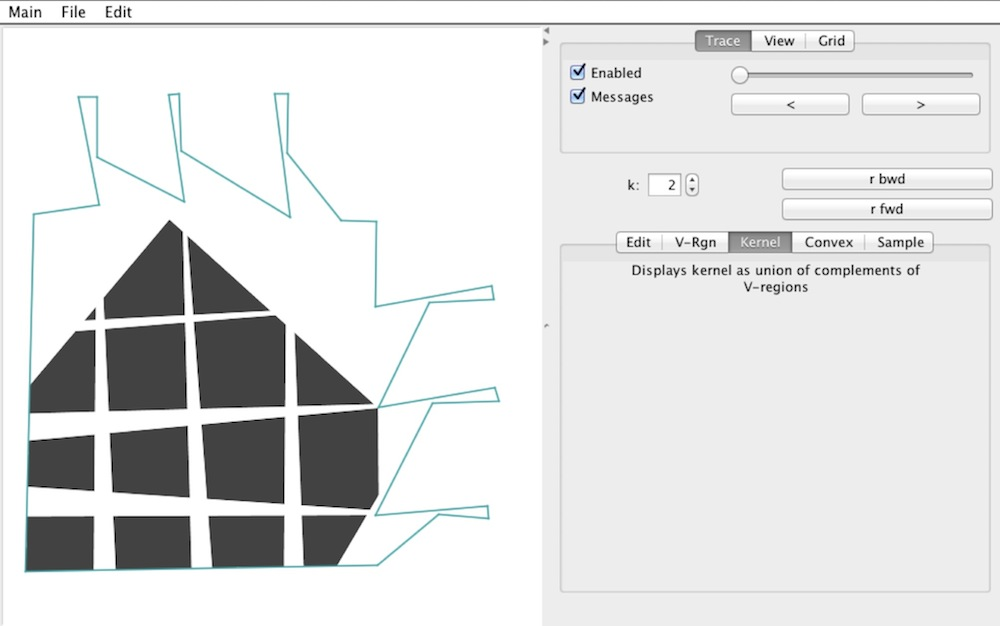

k-Starshaped Polygons
===========

This Java program was used to develop and demonstrate the algorithms 
presented at the 2010 Canadian Conference on Computational Geometry.
The [cccg2010 directory](cccg2010) contains the presented paper and its accompanying slides.

The program can be run as an application; its main class is starshaped.SSMain.class.
It can also be run as an applet, by loading the page "Applet.html" within a browser
(or from the command line: "appletviewer Applet.html"), or by visiting [this link](http://www.cs.ubc.ca/~jpsember/ss.html).

